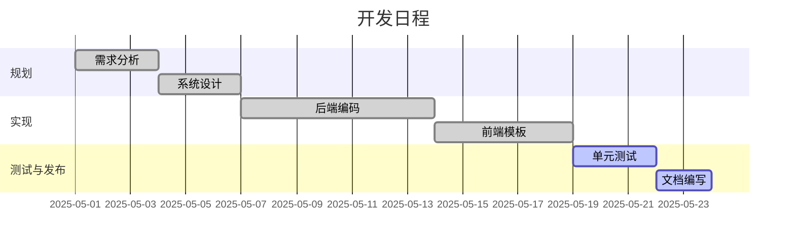
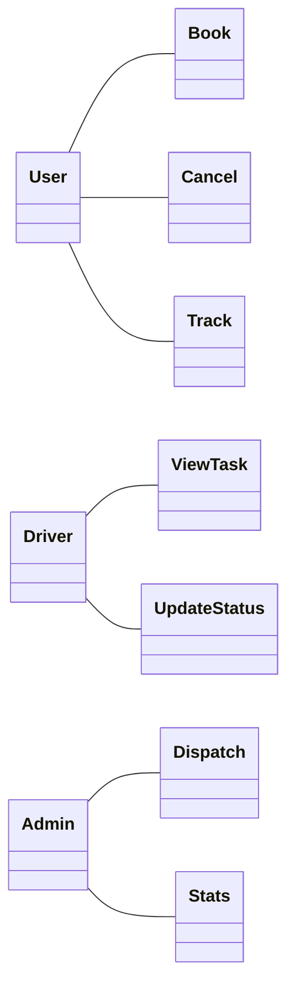
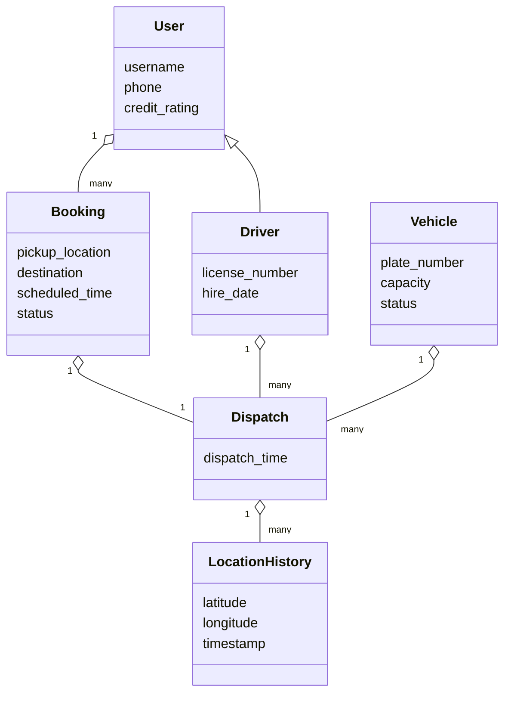
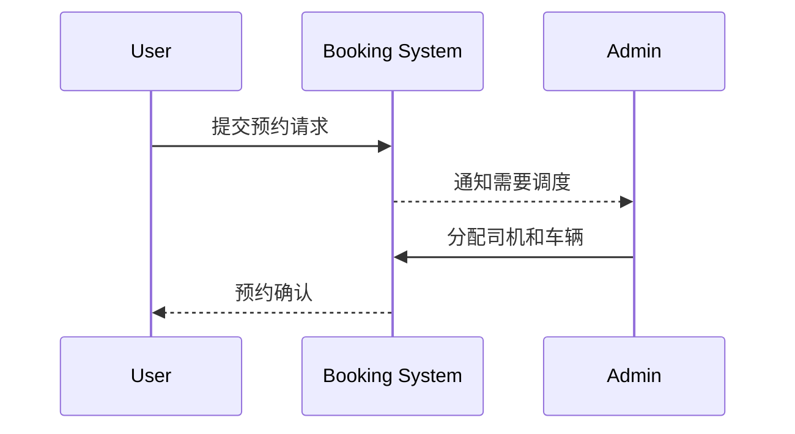
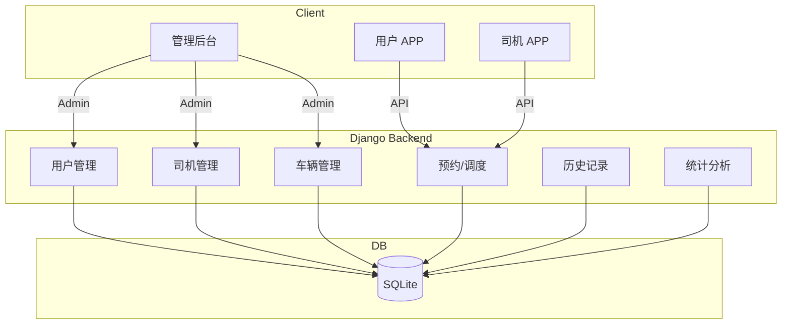

# 校车管理系统项目报告

本文档以中文形式梳理仓库内示例 Django 项目的计划、需求、设计以及测试情况。

## 1. 项目计划

项目采用小型迭代式流程。下表以 Mermaid Gantt 图展示了简化的时间安排。



## 2. 项目需求

在《软件开发（三五页，重点看需求，工具，画图纸）.pdf》中，系统涉及三类主要角色：普通用户、司机以及管理员。核心用例如下图所示。



系统需求总结如下：

- **用户端**：注册登录、预约与取消校车、查看历史记录、查询信用等级、实时查看车辆位置等。
- **司机端**：查看派车任务、更新行程状态、共享 GPS 坐标、查看任务统计等。
- **后台管理端**：管理用户、司机、车辆，根据预约情况调度车辆，实时监控并进行历史数据分析。

## 3. 设计

### 3.1 类图

Django 模型与文档中的实体对应关系紧密，下面展示简化后的类图。



### 3.2 预约流程顺序图



### 3.3 系统架构

整体架构分为三层：移动端/浏览器客户端、Django 后端以及 SQLite 数据库。后台管理
界面基于 Django Admin 构建，同时提供 REST 风格接口供用户端与司机端调用。数据
可视化页面使用 Matplotlib/Plotly 生成图表。模块关系如图所示。



### 3.4 模块划分

根据 PDF 说明，系统主要划分为下表中的功能模块：

| 模块名称   | 描述                                   |
|------------|----------------------------------------|
| 用户管理   | 查看/新增/修改/删除用户信息             |
| 司机管理   | 查看/新增/修改/删除司机信息             |
| 车辆管理   | 查询车辆状态并维护车辆信息             |
| 预约管理   | 查询和编辑乘客的预约记录               |
| 调度管理   | 手动或辅助方式分派车辆与司机           |
| 历史记录   | 保存并查询车辆行驶轨迹和任务记录       |
| 统计分析   | 使用 Matplotlib/Plotly 生成运营图表     |

### 3.5 技术栈

项目使用的主要工具和库如下表所示：

| 技术       | 作用                                 | 是否开源 |
|------------|--------------------------------------|---------|
| Django     | 构建后台管理和 API 接口               | ✅       |
| SQLite     | 轻量级数据库，便于部署               | ✅       |
| Bootstrap  | 提供基础 UI 样式，页面简洁           | ✅       |
| Matplotlib/Plotly | 绘制统计图形                     | ✅       |
| Jinja2     | Django 模板引擎，渲染动态页面         | ✅       |
| Git        | 版本管理与协作开发                   | ✅       |
| Postman    | 调试和测试接口                       | ✅       |

## 4. 源码概览

项目代码分为顶层 `school_bus` 配置和核心应用 `bus_system` 两部分，目录结构如下。

```text
manage.py                # 命令行入口
school_bus/
    settings.py          # 全局配置，启用 SQLite 和自定义用户模型
    urls.py              # 项目路由入口，包含 admin 与 bus 应用
bus_system/
    models.py            # 定义 User、Driver、Vehicle、Booking 等模型类
    views.py             # realtime_monitor、update_location、statistics_view
    admin.py             # 后台管理注册及列表显示设置
    management/commands/
        init_data.py     # 初始化演示数据的自定义命令
    templates/           # 基于 Bootstrap 的前端模板
    tests.py             # 单元测试用例
```

主要函数说明：

- **`realtime_monitor(request)`**：查询状态为已确认的调度信息并渲染监控页面；
- **`update_location(request, dispatch_id)`**：接受司机上传的经纬度并保存到
  `LocationHistory`；
- **`statistics_view(request)`**：将静态统计数据传入模板，展示预约量和热门路线等。

管理命令 `init_data` 会创建管理员、普通用户、司机及多辆车辆，方便开发时快速构造数据。 

## 5. 测试

### 5.1 测试计划

单元测试覆盖模型逻辑及主要视图，可通过 Django 开发服务器进行手动验证。

### 5.2 测试用例

1. **车辆创建**：验证 `Vehicle` 对象保存车牌号和容量。
2. **预约创建**：确保新建预约默认状态为 `P`（待处理）。
3. **实时监控视图**：登录用户访问时返回 HTTP 200，页面包含“实时车辆监控”。
4. **位置更新接口**：向 `update-location` 端点 POST 经纬度数据后应生成一条
   `LocationHistory` 记录。

### 5.3 测试报告

安装依赖后执行 `python manage.py test`，4 个用例全部通过。

```
Creating test database for alias 'default' ('file:memorydb_default?mode=memory&cache=shared')...
Found 4 test(s).
System check identified some issues:

WARNINGS:
?: (staticfiles.W004) The directory '/workspace/Codex-Software-Text/static' in the STATICFILES_DIRS setting does not exist.

System check identified 1 issue (0 silenced).
...
test_update_location_endpoint (bus_system.tests.BusSystemTests.test_update_location_endpoint)
POST 经纬度数据后应在数据库中保存记录 ... ok
----------------------------------------------------------------------
Ran 4 tests in 4.876s

OK
Destroying test database for alias 'default' ('file:memorydb_default?mode=memory&cache=shared')...
```

## 6. 配置管理

项目通过 Git 进行版本控制，代码、迁移文件以及本报告的演变都可追溯。

