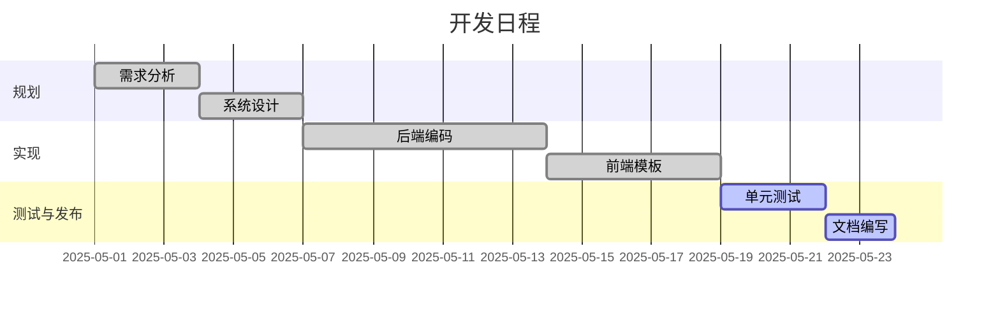
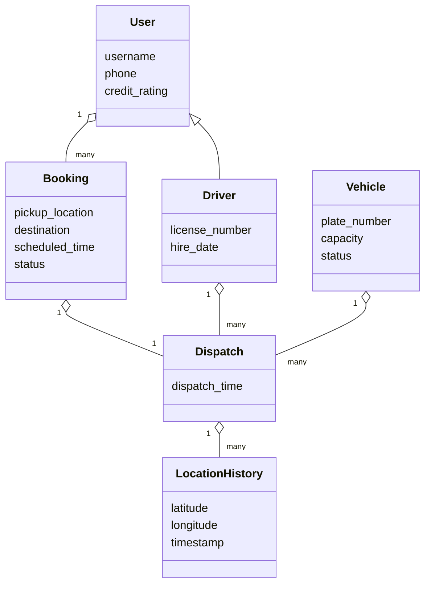
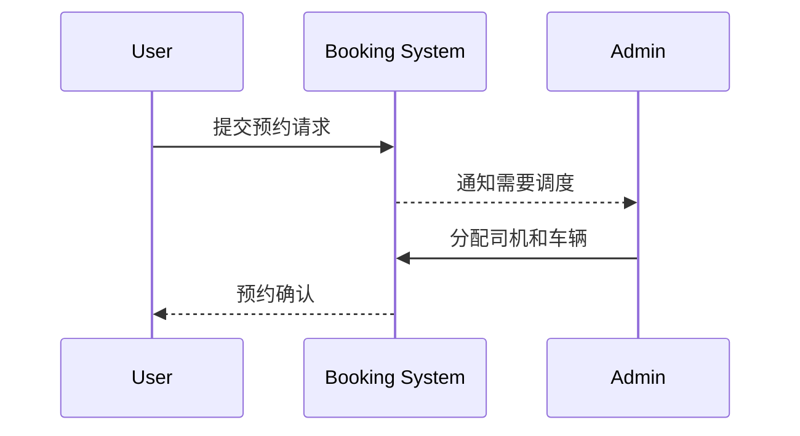

# 校车管理系统项目报告

本文档以中文形式梳理仓库内示例 Django 项目的计划、需求、设计以及测试情况。

## 1. 项目计划

项目采用小型迭代式流程。下表以 Mermaid Gantt 图展示了简化的时间安排。



## 2. 项目需求

在《软件开发（三五页，重点看需求，工具，画图纸）.pdf》中，系统涉及三类主要角色：普通用户、司机以及管理员。核心用例如下图所示。

```mermaid
%% UML use case diagram for requirements
classDiagram
    direction LR
    class User
    class Driver
    class Admin
    class "预约校车" as Book
    class "取消预约" as Cancel
    class "查看实时位置" as Track
    class "查看任务" as ViewTask
    class "更新车辆状态" as UpdateStatus
    class "车辆调度" as Dispatch
    class "统计分析" as Stats
    User -- Book
    User -- Cancel
    User -- Track
    Driver -- ViewTask
    Driver -- UpdateStatus
    Admin -- Dispatch
    Admin -- Stats
```

系统需求总结如下：

- **用户端**：注册登录、预约与取消校车、查看历史记录、查询信用等级、实时查看车辆位置等。
- **司机端**：查看派车任务、更新行程状态、共享 GPS 坐标、查看任务统计等。
- **后台管理端**：管理用户、司机、车辆，根据预约情况调度车辆，实时监控并进行历史数据分析。

## 3. 设计

### 3.1 类图

Django 模型与文档中的实体对应关系紧密，下面展示简化后的类图。



### 3.2 预约流程顺序图



## 4. 源码概览

实现位于 `bus_system` Django 应用及 `school_bus` 项目配置中，主要模块包括：

- `models.py` – 用户、司机、车辆、预约及调度等数据模型。
- `views.py` – 实时监控视图、位置更新接口及统计页面。
- `tests.py` – 模型创建与监控视图的单元测试。

## 5. 测试

### 5.1 测试计划

单元测试覆盖模型逻辑及主要视图，可通过 Django 开发服务器进行手动验证。

### 5.2 测试用例

1. **车辆创建**：验证 `Vehicle` 对象保存车牌号和容量。
2. **预约创建**：确保新建预约默认状态为 `P`（待处理）。
3. **实时监控视图**：登录用户访问时返回 HTTP 200，页面包含“实时车辆监控”。

### 5.3 测试报告

安装 Django 后执行 `python manage.py test`，全部测试通过。

```
Creating test database for alias 'default'...
Found 3 test(s).
System check identified some issues:

WARNINGS:
?: (staticfiles.W004) The directory '/workspace/Codex-Software-Text/static' in the STATICFILES_DIRS setting does not exist.

System check identified 1 issue (0 silenced).
...
----------------------------------------------------------------------
Ran 3 tests in 3.3s

OK
Destroying test database for alias 'default'...
```

## 6. 配置管理

项目通过 Git 进行版本控制，代码、迁移文件以及本报告的演变都可追溯。

